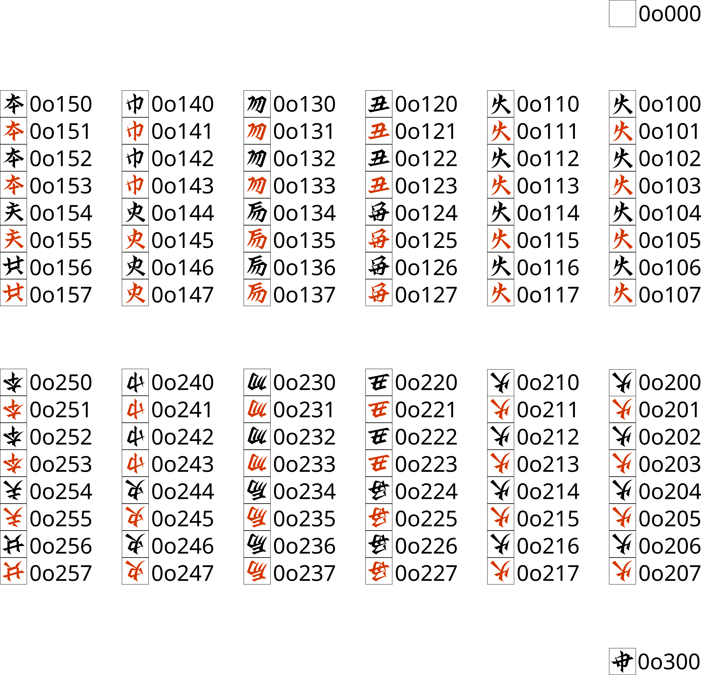

# cetkaik_compact_representation
机戦の盤面をコンパクトに格納する

## 格納方法

まず、以下を「駒番号」とする。



### Board
Board は、9 × 9 の二次元配列に、以下の順序で駒情報を詰めたものであり、81 バイトで構成されてアラインメントは 1 である。

```
[
  [KA, LA, ..., PA],
  [KE, LE, ..., PE],
  ...
  [KIA, LIA, ..., PIA]
]
```

- 空マスは 0
- 皇は 49
- IA 側の駒（つまり、この向きで表示したときに正立している駒）は駒番号そのまま
- A 側の駒は駒番号に 128 を加えたもの（128 と bitor したもの）

### Field
Field は、Board に手駒情報を加えたものであり、手駒情報は 96 ビット（= 12 バイト）のビットベクトルで表される。アラインメントは 1 である。
