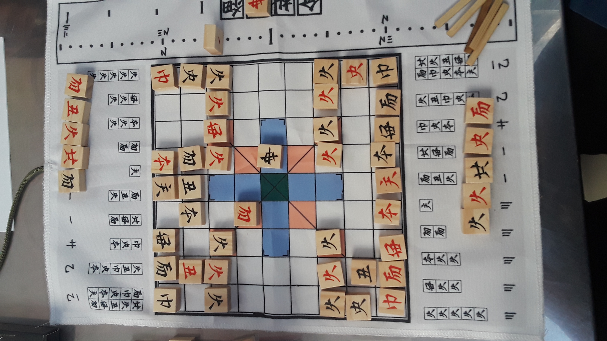
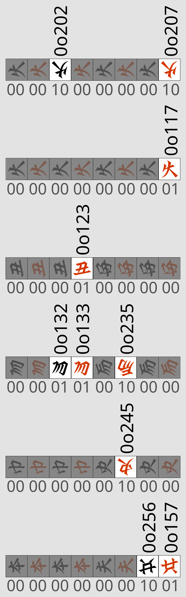

# cetkaik_compact_representation
机戦の盤面をコンパクトに格納する

## 格納方法

まず、以下を「駒番号」とする。


駒番号の上位 2bit は、以下の情報を保持する。

- 上位 2bit が 0b00 → どちらも動かせない（空きマス）
- 上位 2bit が 0b01 → IASideが動かせる（通常駒） 
- 上位 2bit が 0b10 → ASideが動かせる（通常駒）
- 上位 2bit が 0b11 → どちらも動かせる（皇）

一方で、通常駒の下位 6bit はゲーム内の全体で unique であり、「盤面から手駒への移動」「手駒から盤面に移動」を経ても下位 6bit は変化しない。

### Board
Board は、9 × 9 の二次元配列に、以下の順序で駒情報を詰めたものであり、81 バイトで構成されてアラインメントは 1 である。

```
[
  [KA, LA, ..., PA],
  [KE, LE, ..., PE],
  ...
  [KIA, LIA, ..., PIA]
]
```

初期盤面に対する駒番号の割り当ては、便宜上次のようにする。

```
[
  [0o242, 0o236, 0o226, 0o252, 0o255, 0o253, 0o227, 0o237, 0o243],
  [0o247, 0o223, 0o000, 0o233, 0o000, 0o232, 0o000, 0o222, 0o246],
  [0o210, 0o211, 0o212, 0o213, 0o257, 0o217, 0o216, 0o215, 0o214],
  [0o000, 0o000, 0o000, 0o000, 0o000, 0o000, 0o000, 0o000, 0o000],
  [0o000, 0o000, 0o000, 0o000, 0o300, 0o000, 0o000, 0o000, 0o000], 
  [0o000, 0o000, 0o000, 0o000, 0o000, 0o000, 0o000, 0o000, 0o000], 
  [0o100, 0o101, 0o102, 0o103, 0o156, 0o107, 0o106, 0o105, 0o104], 
  [0o144, 0o120, 0o000, 0o130, 0o000, 0o131, 0o000, 0o121, 0o145], 
  [0o141, 0o135, 0o125, 0o151, 0o154, 0o150, 0o124, 0o134, 0o140],
]
```

### Field
Field は、Board に手駒情報を加えたものであり、手駒情報は 96 ビット（= 12 バイト）のビットベクトルで表される。アラインメントは 1 である。


#### 具体例


これは、ASide の赤虎 (0o233)・赤弓 (0o223)・赤兵 (0o217)・赤船 (0o257)・黒虎 (0o232) が IASide の手駒に移っており、IASide の黒兵 (0o102)・赤兵 (0o107)・黒船 (0o156)・赤巫 (0o145)・赤馬 (0o135) が ASide の手駒に移っているので、



であり、

```
[
    0b00001000, /* 兵 */ 0b00000010, /* 兵 */
    0b00000000, /* 兵 */ 0b00000001, /* 兵 */
    0b00000001, /* 弓 */ 0b00000000, /* 車 */
    0b00000101, /* 虎 */ 0b00100000, /* 馬 */
    0b00000000, /* 筆 */ 0b00100000, /* 巫 */
    0b00000000, /* 将 */ 0b00001001 /* 王と船 */
]
```

となる。

